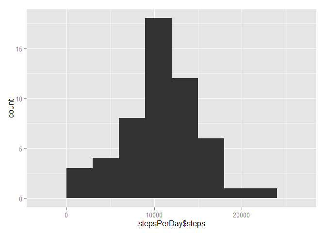
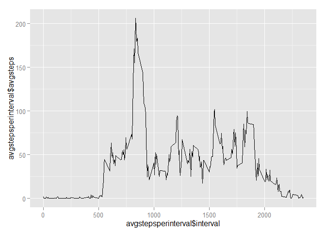
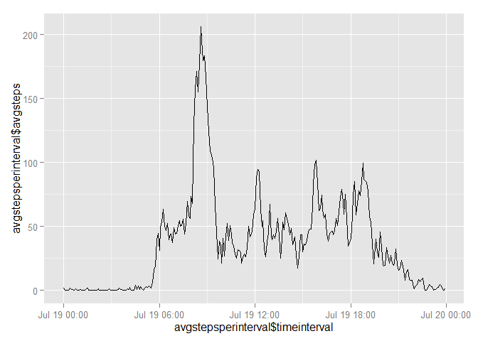
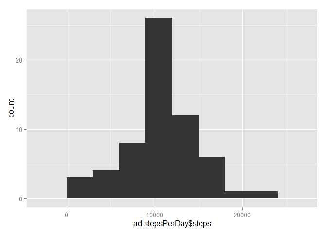
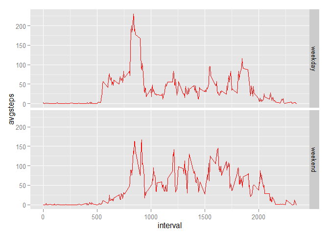

# Reproducible Research: Peer Assessment 1


## Loading and preprocessing the data

Show any code that is needed to

Load the data (i.e. read.csv())

Process/transform the data (if necessary) into a format suitable for your analysis


```r
rm(list = ls())
unzip("activity.zip")
activity <- read.csv("activity.csv")
activity$date <- as.Date(activity$date,"%Y-%m-%d")
summary(activity)
```

```
##      steps             date               interval     
##  Min.   :  0.00   Min.   :2012-10-01   Min.   :   0.0  
##  1st Qu.:  0.00   1st Qu.:2012-10-16   1st Qu.: 588.8  
##  Median :  0.00   Median :2012-10-31   Median :1177.5  
##  Mean   : 37.38   Mean   :2012-10-31   Mean   :1177.5  
##  3rd Qu.: 12.00   3rd Qu.:2012-11-15   3rd Qu.:1766.2  
##  Max.   :806.00   Max.   :2012-11-30   Max.   :2355.0  
##  NA's   :2304
```

## What is mean total number of steps taken per day?

For this part of the assignment, you can ignore the missing values in the dataset.

Calculate the total number of steps taken per day


```r
stepsPerDay <- aggregate(data.frame(steps = activity$steps),by = list(date = activity$date),FUN = sum)
head(stepsPerDay)
```

```
##         date steps
## 1 2012-10-01    NA
## 2 2012-10-02   126
## 3 2012-10-03 11352
## 4 2012-10-04 12116
## 5 2012-10-05 13294
## 6 2012-10-06 15420
```

*Total steps per day are stored in the stepsPerDay dataframe.  Head is shown above. *  

If you do not understand the difference between a histogram and a barplot, research the difference between them. Make a histogram of the total number of steps taken each day


```r
library(ggplot2)
plot <- ggplot(stepsPerDay,aes(x=stepsPerDay$steps))
plot + geom_histogram(binwidth = 3000)
```

 

## What is the average daily activity pattern?

Calculate and report the mean and median of the total number of steps taken per day


```r
mean <- mean(na.omit(stepsPerDay$steps))
median <- median(na.omit(stepsPerDay$steps))
```
*Mean:   10766.19  
Median: 10765*

Make a time series plot (i.e. type = "l") of the 5-minute interval (x-axis) and the average number of steps taken, averaged across all days (y-axis) 

*Firstly, I've removed all the NA from the dataset and then create a new dataset with the average number of steps per time interval.*

*The plot uses the interval on the x axis which gives the visualisation I need.*


```r
na.activity <- na.omit(activity)
avgstepsperinterval <- aggregate(data.frame(avgsteps = na.activity$steps),by = list(interval = na.activity$interval),FUN = mean)
plot <- ggplot(avgstepsperinterval,aes(avgstepsperinterval$interval,avgstepsperinterval$avgsteps))
plot + geom_line()
```

 

*I can also create a POSIXCT object for the interval and uses as the time series in the plot, it includes a date which I'm not interested in.  But I do get the visualisation I need. Here is that R code and the plot.*  


```r
avgstepsperinterval$timeinterval <- strptime(sprintf("%04d",avgstepsperinterval$interval),"%H%M")
plot <- ggplot(avgstepsperinterval,aes(avgstepsperinterval$timeinterval,avgstepsperinterval$avgsteps))
plot + geom_line()
```

 


Which 5-minute interval, on average across all the days in the dataset, contains the maximum number of steps?


```r
maxavginterval <- avgstepsperinterval[which(avgstepsperinterval$avgsteps == max(avgstepsperinterval$avgsteps)),1]
```

*Interval with the max average of steps accross all dates is 835 *


## Imputing missing values

Note that there are a number of days/intervals where there are missing values (coded as NA). The presence of missing days may introduce bias into some calculations or summaries of the data.

Calculate and report the total number of missing values in the dataset (i.e. the total number of rows with NAs)


```r
nas <- sum(is.na(activity))
```

*There are 2304 missing values in the dataset*

Devise a strategy for filling in all of the missing values in the dataset. The strategy does not need to be sophisticated. For example, you could use the mean/median for that day, or the mean for that 5-minute interval, etc.

Create a new dataset that is equal to the original dataset but with the missing data filled in.

*I've used the interval mean calculated earlier in the assignment to fill the missing values in the dataset. *


```r
adjustedactivity <- activity
indexnas <- which(is.na(adjustedactivity$steps))
stepslist <- adjustedactivity$steps
stepslist[indexnas] <- avgstepsperinterval[which(avgstepsperinterval$interval == avgstepsperinterval$interval[indexnas]),2]
adjustedactivity$steps <- stepslist
```
Make a histogram of the total number of steps taken each day and Calculate and report the mean and median total number of steps taken per day. Do these values differ from the estimates from the first part of the assignment? What is the impact of imputing missing data on the estimates of the total daily number of steps?


```r
ad.stepsPerDay <- aggregate(data.frame(steps = adjustedactivity$steps),by = list(date = adjustedactivity$date),FUN = sum)
library(ggplot2)
plot <- ggplot(ad.stepsPerDay,aes(x=ad.stepsPerDay$steps))
plot + geom_histogram(binwidth = 3000)
```

 
Calculate and report the mean and median of the total number of steps taken per day on the filled dataset


```r
ad.mean <- mean(ad.stepsPerDay$steps)
ad.median <- median(ad.stepsPerDay$steps)
```

*Mean:   10766.19  
Median: 10766.19* 

*The sum of the steps per day is much greater on the dataset where the missing values have been filled as there are more values to sum.
The Mean remains the same for both data sets while the median has decreased slightly. * 


## Are there differences in activity patterns between weekdays and weekends?

For this part the weekdays() function may be of some help here. Use the dataset with the filled-in missing values for this part.

Create a new factor variable in the dataset with two levels – “weekday” and “weekend” indicating whether a given date is a weekday or weekend day.


```r
# first create a new column daytype and set all the value "weekday", then overide actual weekend days with "weekend"
adjustedactivity$daytype <- "weekday"    
indexweekends <- which((weekdays(adjustedactivity$date) == "Saturday") | (weekdays(adjustedactivity$date) == "Sunday"))
adjustedactivity[indexweekends,4] <- "weekend"
```


Make a panel plot containing a time series plot (i.e. type = "l") of the 5-minute interval (x-axis) and the average number of steps taken, averaged across all weekday days or weekend days (y-axis). See the README file in the GitHub repository to see an example of what this plot should look like using simulated data.


```r
# this piece of code splits the weekday and weekend data to get the mean for each.
# then the datasets are combined agained to the panel plot
# this code is somewhat awkward, but time was running out !!!!
weekdayactivity <- adjustedactivity[adjustedactivity$daytype == "weekday",]
weekendactivity <- adjustedactivity[adjustedactivity$daytype == "weekend",]
avgstepsweekdays <- aggregate(data.frame(avgsteps = weekdayactivity$steps),by = list(interval = weekdayactivity$interval),FUN = mean)
avgstepsweekends <- aggregate(data.frame(avgsteps = weekendactivity$steps),by = list(interval = weekendactivity$interval),FUN = mean)
avgstepsweekdays$daytype <- "weekday"
avgstepsweekends$daytype <- "weekend"

final.avgsteps <- rbind(avgstepsweekdays,avgstepsweekends)
ggplot(data = final.avgsteps, aes(x = interval, y = avgsteps))  +
  geom_line(color = "red") +
  facet_grid(daytype ~ .)
```

 

*The following differences between the week days and weekend day as seen from the plots are shown below*  

*1. There is a peak early in the weekday days*   
*2.The average through the rest of the day generally higher in the weekends*
